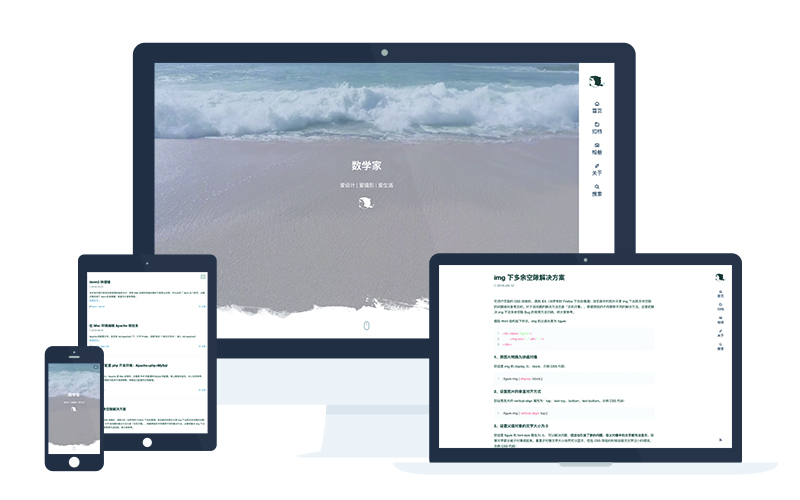

# Ocean

Ocean 是基于 Hexo 默认主题 Landscape 中的功能设计出来的，由于我是一个 Designer 而不失 Coder 所以 Ocean 代码可能并不完美！
非常感谢 [youchen1992](https://github.com/youchen1992) 在 Ocean 制作过程中提供的支持。


[预览](https://zhwangart.github.io)



### 安装

``` bash
$ git clone https://github.com/zhwangart/hexo-theme-ocean.git
```

### 启用

在 `_config.yml` 中设置 `theme` 为 `ocean`.

``` yml
theme: ocean
```

### 更新

``` bash
cd themes/ocean
git pull
```

