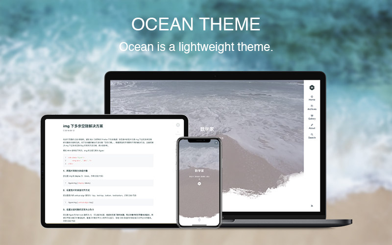

# Ocean

Ocean is a mobile-enabled Hexo theme based on the features in Hexo's default theme landscape. Since I am a Designer and not a Coder, so please advise! I am very grateful to [youchen1992](https://github.com/youchen1992) for providing technical support during the Ocean production process.


[Preview](https://zhwangart.github.io)

[中文说明](https://zhwangart.github.io/2018/11/30/Ocean/)



## Install

``` bash
$ git clone https://github.com/zhwangart/hexo-theme-ocean.git themes/ocean
```

## Enable

Modify `theme` setting in `_config.yml` to `ocean`

``` yml
theme: ocean
```

## Update

``` bash
cd themes/ocean
git pull
```

## Configuration

let me know if you can’t find something.

``` yml
# Menu
menu:
  Home: /
  Archives: /archives
  Gallery: /gallery
  About: /about
  Links: /links
rss: /atom.xml

# Miscellaneous
favicon: /favicon.ico
brand: /images/hexo.svg

# Ocean Video
# Because I put videos in multiple formats on the same path, I just labeled the path here.
ocean:
  overlay: true
  path: images/ocean/      # Video storage path, formats: mp4/ogg/webm
  brand: /images/hexo-inverted.svg      # Optional, a small logo

# Content
excerpt_link: Read More...

# fancybox
fancybox: true

# Local search
search_text: Search

# Gitalk
gitalk:
  enable: true
  clientID: # GitHub Application Client ID
  clientSecret: # Client Secret
  repo: # Repository name
  owner: # GitHub ID
  admin: # GitHub ID

# Valine
valine:
  enable: false    # Default: false.
  el: 'vcomments'    # The DOM element to be mounted on initialization.
  appId:    # Application appId from Leancloud.
  appKey:    # Application appKey from Leancloud.
  notify: false    # Mail notifier, Default: false.
  verify: true    # Validation code, Default: true.
  avatar: 'mp'    # Gravatar type.
  pageSize: '10'    # Number of pages per page.
  placeholder: '请输入...'    # Comment box placeholders.
```

The [feathericon](https://feathericon.com) in the menu is programmed ordely in "CSS `source/css/_partial/navbar.styl` " and can be changed or added if needed.

``` css
.nav-item
  &:nth-child(1)         // home
    .nav-item-link
      &::before
        content '\f12f'
  &:nth-child(2)         // archives
    .nav-item-link
      &::before
        content '\f12a'
  //&:nth-child(3)         // gallery
  //  .nav-item-link
  //    &::before
  //      content '\f1a9'
  //&:nth-child(4)         // about
  //  .nav-item-link
  //    &::before
  //      content '\f174'
  //&:nth-child(5)         // links
  //  .nav-item-link
  //    &::before
  //      content '\f136'
```

## Plugins

+ [hexo-generator-search](https://github.com/hexojs/hexo-theme-landscape) Local search
	
  ```yml
  $ npm install hexo-generator-searchdb --save
  ```
  Then add the plugin configuration for hexo's configuration file `_config.yml` (note: not the theme's configuration file):
  
  ```yml
  # Hexo-generator-search
  search:
    path: search.xml
    field: post
    format: html
  ```

+ [hexo-generate-feed](https://github.com/hexojs/hexo-generator-feed) RSS

  ```yml
  $ npm install hexo-generator-feed --save
  ```
  
  Then add the plugin configuration for hexo's configuration file `_config.yml` (note: not the theme's configuration file):
  
  ```yml
  feed:
      type: atom
      path: atom.xml
      limit: 20
      hub:
      content:
      content_limit: 140
      content_limit_delim: ' '
      order_by: -date	
  ```
  
+ [hexo-generator-index-pin-top](https://github.com/netcan/hexo-generator-index-pin-top)
	
	``` bash
  $ npm uninstall hexo-generator-index --save
  $ npm install hexo-generator-index-pin-top --save
  ```

## Post poster

``` md
---
title: Post name

photos: [
        ["img_url"],
        ["img_url"]
        ]
---
```

## Gallery
Need to write in the head of the markdown, this is not a good way to write, I hope to get a better way to write on github.

``` md
---
title: Gallery

albums: [
        ["img_url","img_caption"],
        ["img_url","img_caption"]
        ]
---
```

## Toc

Use Tocbot to parse the title tags (h1~h6) in the content and insert the directory. 

+ ocean/_config.yml

	``` bash
	# Toc
  toc: true
	```
+ If Toc is turned on in ocean/_config.yml, then Tocbot will generate a Toc article directory in the title tag of each blog parsing content, but not all blogs require Toc, so in the Front-matter section of markdown Can be closed:

	``` md
	---
  toc: false
  ---
	```

---
